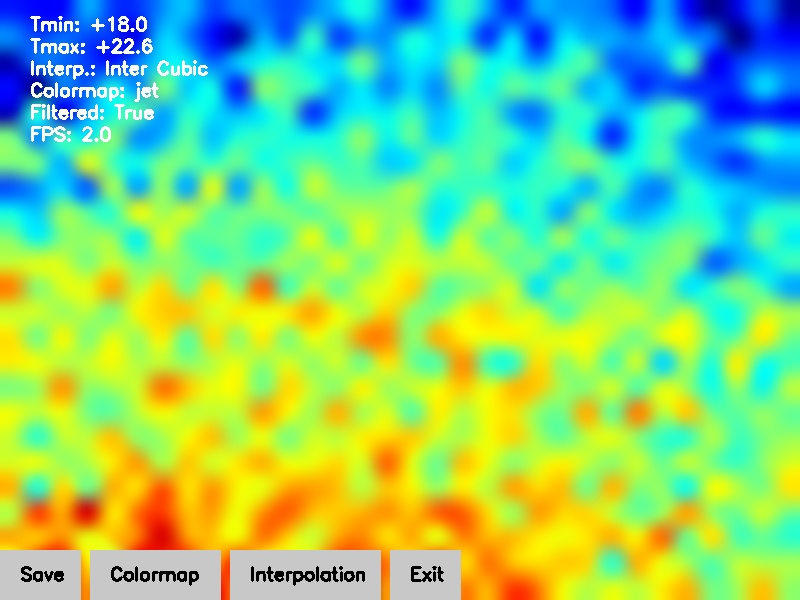

Python script for viewing Adafruit MLX90640 thermal camera output on a Raspberry Pi. Based on [tomshaffner/PiThermalCam](https://github.com/tomshaffner/PiThermalCam) and written for use on a touchscreen display.

## Screenshot

